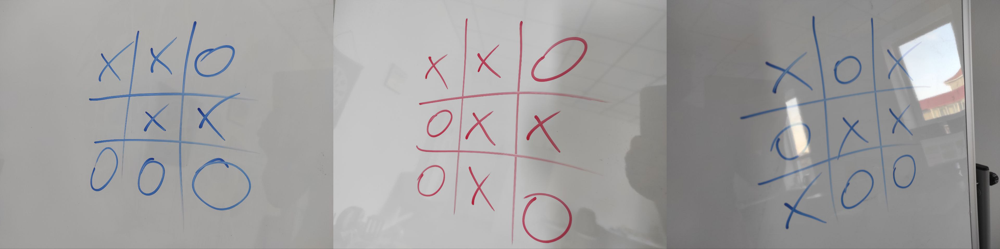
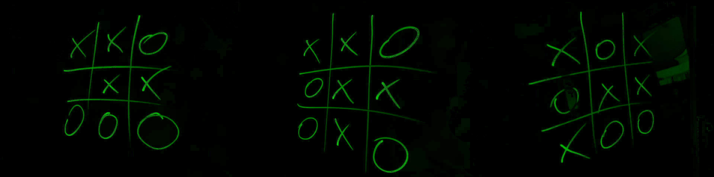
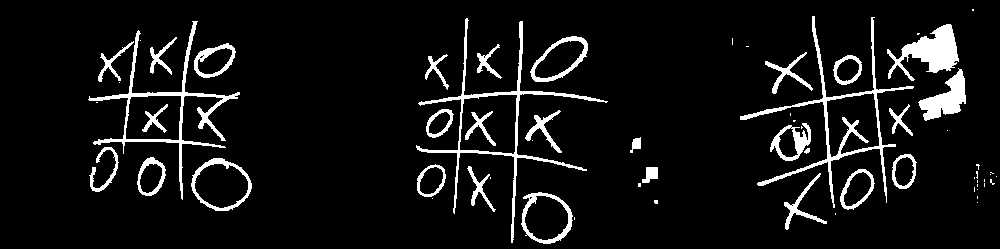
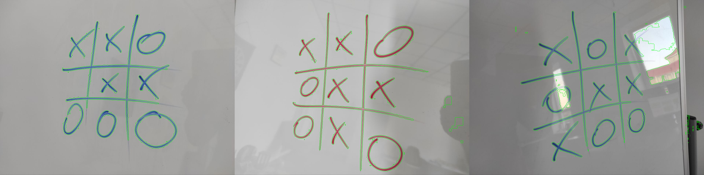
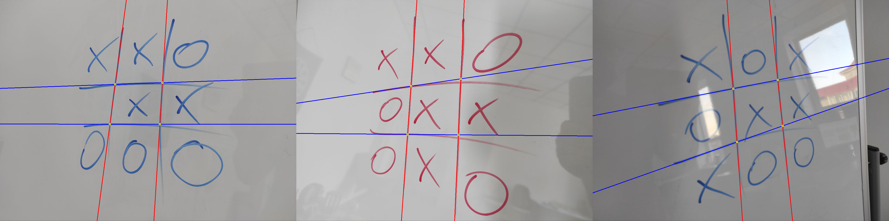
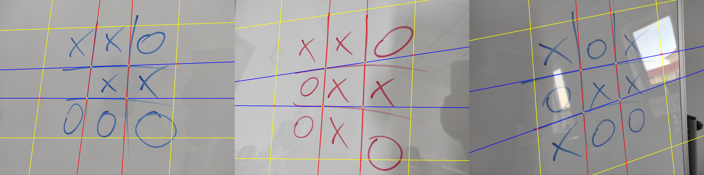
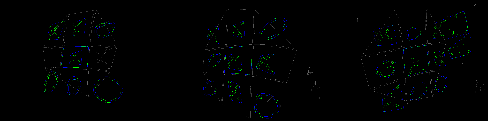
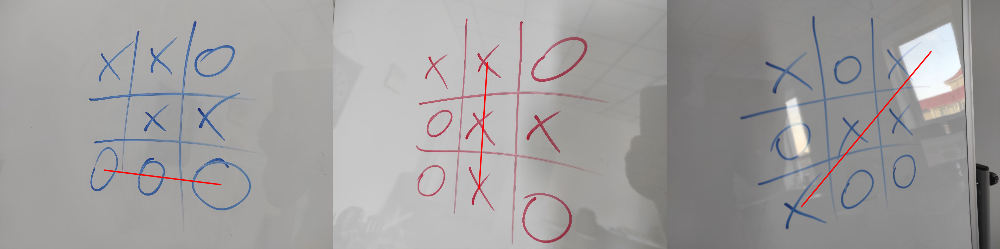

# Tic Tac Toe Game Analysis
The task is to find a winner of a Tic-Tac-Toe game and draw a line that crosses the winning combination
## Solution
I used OpenCV and scikit-image to solve the problem.  
Here are the steps I took with illustrations:  
0. Load the image

1. Segment the image (using scikit-image's `clear_border()`) to highlight the game drawing

2. Convert to grayscale, binarize using thresholding, remove noise

3. Find contours

4. Find lines using Hough Lines on skeletonized image. Then select only 4 lines out of many overlapping ones. And find the intersection points.

5. Roughly estimate the grid cells, where X and O should be. It doesn't have to be very accurate, but the centers of X or O should lie inside predicted cells.

6. Out of all contours find the ones that correspond to X, O and their positions. Then determine whether it is X or O.  
The main properties to tell them apart are:  
The convexity of a contour (area of the contour / area of the convex hull) - O is most likely close to convex and X is not.  
The distance from the center of mass to the closest point of the contour. It can be calculated using `cv2.pointPolygonTest` and it is low for X and large for O.  
If based on contours we cannot tell it is X or O, we crop the cell (in step 5 we estimated the cells), apply projective transformation and then recognize it as X or O or None.

7. Find a winning combination and draw a line.

